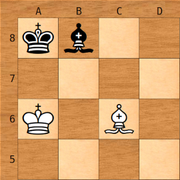
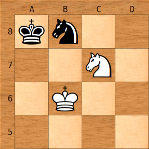

<!-- @import "[TOC]" {cmd="toc" depthFrom=1 depthTo=6 orderedList=false} -->

<!-- code_chunk_output -->

- [Detecting draws by FIDE rules](#detecting-draws-by-fide-rules)
  - [Draw by fifty moves rule](#draw-by-fifty-moves-rule)
  - [Draw by three-fold repetition rule](#draw-by-three-fold-repetition-rule)
  - [Draw by insufficient material rule](#draw-by-insufficient-material-rule)

<!-- /code_chunk_output -->

# Detecting draws by FIDE rules

To be able to play chess properly, the engine has to be able to detect
draws. In addition, to fully support the XBoard protocol [(see the chapter
about communication)](../communication/communication.html), it has to be
able to claim these draws. This chapter describes how to use the board
representation to detect them. The functions listed in this chapter can be
found in the file *draws.rs* in the *Board*-module.

The FIDE Handbook of the Laws of Chess can be downloaded here: [download
(FIDE-site)](https://www.fide.com/FIDE/handbook/LawsOfChess.pdf)

## Draw by fifty moves rule

This is stated as follows:

>The game is drawn, upon a correct claim by a player having the move, if:
>
> ... he writes his move, which cannot be changed, on his scoresheet and
> declares to the arbiter his intention to make this move which will result
> in the last 50 moves by each player having been made without the movement
> of any pawn and without any capture, or 9.3.2 the last 50 moves by each
> player have been completed without the movement of any pawn and without
> any capture.

And important part in this rule is "by each player": both players have to
make 50 moves without a capture or a pawn move for a draw to be claimed.
Many people stop playing after 50 moves in total, which would thus be 25
moves by each player. This is incorrect.

The board keeps a game state, which contains the so-called "half-move
clock". This is a counter, which counts the number of ply's (a "ply" is one
move by one player) that have been played without capturing a piece or
moving a pawn. As soon as a piece is captured or a pawn is moved, this
counter is reset to 0. Therefore a draw can be reported very easily:

```rust,ignore
pub fn draw_by_fifty_move_rule(&self) -> bool {
    self.game_state.halfmove_clock >= MAX_MOVE_RULE
}
```

MAX_MOVE_RULE is set to 100, because each player has to play 50 moves,
which is 100 ply in total. When this function is called it returns true if
the game, at that point, is drawn by the fifty move rule.

## Draw by three-fold repetition rule

This rule is one of the more extensive draw rules, stated as follows:

> The game is drawn upon a correct claim by the player having the move,
> when the same position, for at least the third time (not necessarily by a
> repetition of moves):
>
> a. is about to appear, if he first writes his move on his scoresheet and
> declares to the arbiter his intention to make this move, or...
>
> b. has just appeared, and the player claiming the draw has the move.
> 
> Positions as in (a) and (b) are considered the same, if the same player
> has the move, pieces of the same kind and colour occupy the same squares,
> and the possible moves of all the pieces of both players are the same.
> Positions are not the same if a pawn that could have been captured en
> passant can no longer be captured in this manner. When a king or a rook
> is forced to move, it will lose its castling rights, if any, only after
> it is moved.

To be able to follow this rule, the engine has to have [Zobrist
hashing](./zobrist_hashing.md) implemented already, so positions can be
uniquely identified. *Everything* in the position has to be the same. This
includes "available moves", "player to move", "en passant", and "castling
rights" as mentioned above.

Example: if the white king could castle in a certain position, then moves
one square from E1 to D1 and back again from D1 to E1, a position may be
reached that looks the same. It isn't, because the white king has lost its
castling rights, so the moves available to the white player are not the
same anymore. The Zobrist-keys take this and other nuances into account.

What we have to do is compare the position that is on the board at this
very moment, to the positions that have been seen in the past. The engine's
game state keeps a history array, which contains the Zobrist-keys for every
position that has been on the board since the beginning of the game.

To determine if the game is a draw, we walk through this history array
backwards. Each time we encounter the same Zobrist-key as the one we have
for the current position, we increment a counter.

We can stop searching for repetitions as soon as we encounter a pawn move
or a piece capture, because such a move irrevocably changes the position.
Therefore our current position can never have been on the board before this
point.

This is the function:

```rust,ignore
pub fn draw_by_repetition_rule(&self) -> u8 {
    let mut count = 0;
    let mut stop = false;
    let mut i = (self.history.len() - 1) as i16;

    while i >= 0 && !stop {
        let historic = self.history.get_ref(i as usize);

        // If the historic zobrist key is equal to the one of the board
        // passed into the function, then we found a repetition.
        if historic.zobrist_key == self.game_state.zobrist_key {
            count += 1;
        }

        // If the historic half move clock is 0, it indicates that
        // this position was created by a capture or pawn move. 
        stop = historic.halfmove_clock == 0;

        // Search backwards
        i -= 1;
    }
    count
}
```

We can claim a draw by threefold repetition if this function returns at
least 2: the current board position has been encountered twice before, so
the one we have on the board right now is the third repetition.

## Draw by insufficient material rule

> Note: If you are only implementing the UCI protocol, then you can omit
> this function. It is only needed for the XBoard protocol to be able to
> claim draw by insufficient material under the FIDE rules. The engine also
> has a function called *sufficient_material_to_force_checkmate()*, which
> is used while searching and can score drawn positions, which is
> sufficient for UCI.

There is a rule in chess which is often misunderstood: draw by insufficient
material. It seems simple: if none of the players have enough material on
the board to checkmate the king, a draw can be claimed. However, this is
not exactly what handbook says. The relevant rule is as follows:

> The game is drawn when a position has arisen in which neither player can
> checkmate the opponent’s king with any series of legal moves.

This is slightly different from the commonly held belief of "not having
enough material to checkmate the enemy king can be claimed as a draw." If
you have a King+Bishop vs. King, then the position is a draw, because no
player can checkmate the other using any series of legal moves. What about
King+Bishop vs. King+Bishop, or King+Knight vs. King+Knight? These
positions should be drawn, because no player can achieve a mate, right?
Wrong...

K+B vs. K+B:<br />


K+N vs. K+N:<br />


*Foul play!* I hear you cry. *Black must have assisted white in achieving
these mates, because they cannot be forced!* True enough: these mates
cannot be forced. Black must assist white by blocking his own king with his
last move, so white can deliver mate. However, these positions are
achievable through a series of legal moves. This means that a player can
not _claim_ a draw on the basis of insufficient material. Of course, both
players can agree on a draw because they both know that the other will not
assist in getting mated. Even if one of the players refuses to agree on a
draw, the game will eventually run into the 50-move rule and be drawn
anyway.

Because of the above, the function which implements this rule
(*draw_by_insufficient_material_rule()*) is different from the function
used during searching (*sufficient_material_to_force_checkmate()*). This
function determines if it is legal, according to the rules of chess, to
claim a draw and end the game. The function used during searching
determines if one of the players is still able to force a checkmate, and if
not, to score the position as a draw.

> Note that no mate can ever be achieved in a King+Bishop vs. King+Bishop
> position, if both bishops are on squares of the same color. Any position
> with that material is therefore claimable as a draw.

The function implementing this rule is fairly simple. It just lists all the
positions in which a draw by insufficient material can be claimed:

```rust,ignore
pub fn draw_by_insufficient_material_rule(&self) -> bool {
    // Get the piece bitboards for white and black.
    let w = self.get_bitboards(Sides::WHITE);
    let b = self.get_bitboards(Sides::BLACK);

    // Determine if at least one side has either a Queen, a Rook or a pawn (qrp). If this is the
    // case, a draw by rule is not possible because mate can be achieved.
    let qrp = w[Pieces::QUEEN] != 0
        || w[Pieces::ROOK] != 0
        || w[Pieces::PAWN] != 0
        || b[Pieces::QUEEN] != 0
        || b[Pieces::ROOK] != 0
        || b[Pieces::PAWN] != 0;

    if qrp {
        return false;
    }

    // No queens, rooks or pawns. We may have a draw. For this, one of the following conditions
    // in material balance must be true:

    // King vs. King
    let kk = w[Pieces::BISHOP] == 0
        && w[Pieces::KNIGHT] == 0
        && b[Pieces::BISHOP] == 0
        && b[Pieces::KNIGHT] == 0;
    // King/Bishop vs. King
    let kbk = w[Pieces::BISHOP].count_ones() == 1
        && w[Pieces::KNIGHT] == 0
        && b[Pieces::BISHOP] == 0
        && b[Pieces::KNIGHT] == 0;
    // King/Knight vs. King
    let knk = w[Pieces::BISHOP] == 0
        && w[Pieces::KNIGHT].count_ones() == 1
        && b[Pieces::BISHOP] == 0
        && b[Pieces::KNIGHT] == 0;
    // King vs. King/Bishop
    let kkb = w[Pieces::BISHOP] == 0
        && w[Pieces::KNIGHT] == 0
        && b[Pieces::BISHOP].count_ones() == 1
        && b[Pieces::KNIGHT] == 0;
    // King vs. King/Knight
    let kkn = w[Pieces::BISHOP] == 0
        && w[Pieces::KNIGHT] == 0
        && b[Pieces::BISHOP] == 0
        && b[Pieces::KNIGHT].count_ones() == 1;
    // King/Bishop vs. King/Bishop
    let kbkb = w[Pieces::BISHOP].count_ones() == 1
        && w[Pieces::KNIGHT] == 0
        && b[Pieces::BISHOP].count_ones() == 1
        && b[Pieces::KNIGHT] == 0;

    // If we have King/Bishop vs King/Bishop, an additional condition applies. Both bishops have
    // to be on the same colored square for a draw to be claimable. If they are on different
    // colored squares, a mate is still possible (even though one player must assist the other
    // in actually achieving it).
    let same_color_sq = if kbkb {
        let wb_sq = w[Pieces::BISHOP].trailing_zeros() as usize;
        let bb_sq = b[Pieces::BISHOP].trailing_zeros() as usize;

        Board::is_white_square(wb_sq) == Board::is_white_square(bb_sq)
    } else {
        false
    };

    // If we have any of these conditions, a draw can be claimed according to FIDE rules of
    // "draw by insufficient material."
    if kk || kbk || knk || kkb || kkn || (kbkb && same_color_sq) {
        return true;
    }

    // All other cases cannot be claimed as a draw.
    false
}
```
