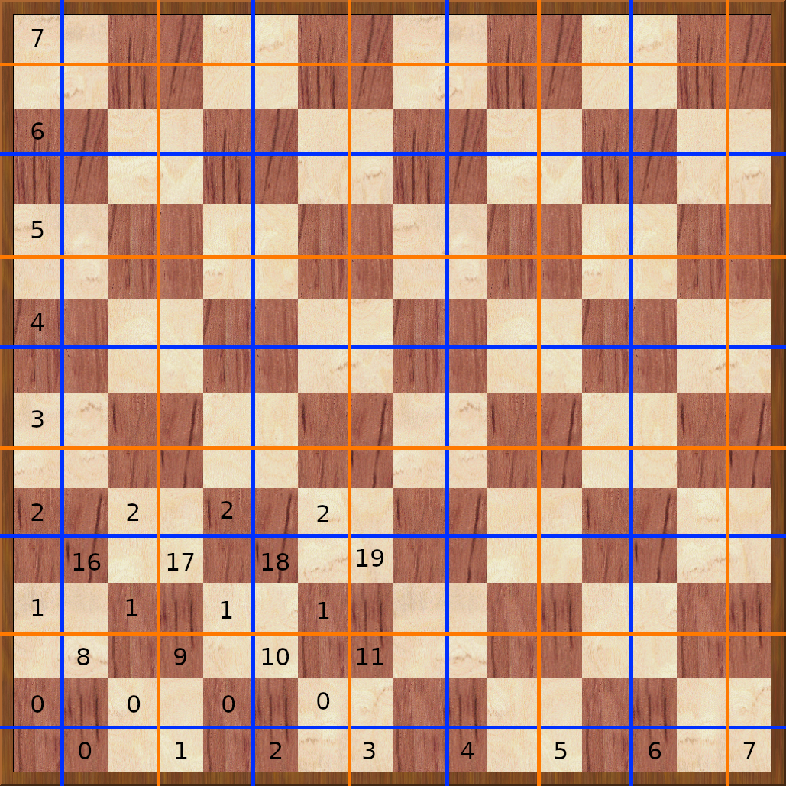

# Detecting the bishop pair

It is very useful to know if one side or the other has a bishop pair, as
having the two bishops can be an advantage in some positions. Some of these
advantages include:

- You can checkmate a lone enemy king with the bishop pair, but not with
  two knights.
- The bishop pair can control two adjacent diagonals over a long distance.
  The enemy king cannot cross this double diagonal.
- Both bishops together can control any square on the board; if you lose
  one, that square color will be weakened.
- Bishops are stronger than knights on an open board. As you move towards
  the endgame, more and more pieces get traded. The board becomes more
  open, so having the bishop pair can be an advantage.

First we need to know what "having the bishop pair" even means. We can
define it as follows:

- One side must have at least two bishops. (Can also be three or more.)
- One bishop must be on a white square, and another on a black square.

If a player has two or more bishops but they are all on the same colored
squares, he does _not_ have the bishop pair. This can happen if the player
trades the dark_squared bishop (retaining the light-squared bishop) and
later promotes a pawn on a light square to a bishop. That would leave the
player with two light-squared bishops, which do _not_ form a bishop pair.

Even if you have five bishops on the same colored squares, you don't have
the bishop pair. In fact, if you have a king and five same-squared bishops
against a bare king, you can't win the game.

The best way to determine if either black or white has a bishop pair is to
just ask the board itself, so we should add a function to calculate this.
It turns out to be very simple:

```rust,ignore
pub fn has_bishop_pair(&self, side: Side) -> bool {
    let mut bishops = self.get_pieces(side, Pieces::BISHOP);
    let mut white_square = 0;
    let mut black_square = 0;

    if bishops.count_ones() >= 2 {
        while bishops > 0 {
            let square = bits::next(&mut bishops);

            if Board::is_white_square(square) {
                white_square += 1;
            } else {
                black_square += 1;
            }
        }
    }

    white_square >= 1 && black_square >= 1
}
```

That's it. We get the bishops for either white or black. We have to end up
with at least one on the white squares, and one on the black squares, so we
must count how many of each we have.

If we have at least two bishops, we start looking if we have a pair. With
one or zero bishops, we already know we won't have a pair. While we still
have bishops, there's still hope. We get the square the current bishop is
on, and then we determine if the square is white or black. We increment the
appropriate value. At the end the function returns true if both
white_square and black_square are at least 1.

The important part is the call to _Board::is_white_square()_. This function
determines if a square is white. There's a nice trick involved there which
needs some explanation. This is _Board::is_white_square()_:

```rust,ignore
pub fn is_white_square(square: Square) -> bool {
    let rank = square / 8;
    let even_square = (square & 1) == 0;
    let even_rank = (rank & 1) == 0;

    (even_rank && !even_square) || (!even_rank && even_square)
}
```

It is very short, but also somewhat cryptic. The function accepts a square
number from 0 to 63. First it determines the rank number on which this
square is located. This ranges from 0 up to and including 7. So now we have
the square number and the rank number. The function determines if those
numbers are even.

If the rank number is even, but the square number uneven, we have a white
square. Or the other way around: if the rank number is uneven but the
square number is even, we also have a white square. To understand this,
take a look at the sketch below.



There are two numbers in each square. In the upper left corner is the rank
number the square belongs to, which runs from 0-7. In the lower right
corner is the square number itself, which runs from 0-63. The blue and
orange lins have these meanings:

- The blue lines indicate ranks and squares having an EVEN number.
- The orange lines indicate ranks and squares having an UNEVEN number.

If you take a closer look at the pattern these lines make, you'll see:

- The black squares either have a completely blue, or a completely orange
  cross. This means that a square is black if:
    - The rank and square numbers are both EVEN (blue cross).
    - The rank and square numbers are both UNEVEN (orange cross).
- The white squares have either a blue/orange or an orange/blue cross. This
  means that a square is white if:
    - The rank number is EVEN and the square number is UNEVEN (blue
      horizontal line, orange vertical line).
    - The rank number is UNEVEN and the square number is EVEN (orange
      horizontal line, blue vertical line).

As such, that is the result for the _Board::is_white_square()_ function:

```rust,ignore
(even_rank && !even_square) || (!even_rank && even_square)
```

So now we can determine if a side has the bishop pair by making the
following two function calls:

```rust,ignore
let white_bishop_pair = board.has_bishop_pair(Sides::WHITE);
let black_bishop_pair = board.has_bishop_pair(Sides::BLACK);
```

Very nice. This will be very useful in determining if the position is a
draw or not. It can also be used as a term in the the evaluation function
to take the presence of the bishop pair into account.