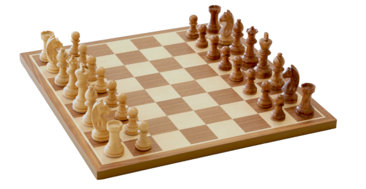

# Introduction

To be able to play the game, the engine has to know the board layout, where
all of the pieces are located throughout the game, and all relevant
information about each position. In the case of Western Chess, the board
and pieces are the following:

- A board is 8 by 8 squares (64 in total), alternating in a light and dark
  color. The squares are normally called light/white or dark/black, even if
  the squares on a real board often have other colors.
- A set of pieces consists of 1 king, 1 queen, 2 rooks, 2 bishops, 2
  knights and 8 pawns. The two sets have distinct colors to differentiate
  them from one another during play. Same as with the squares, these sets
  are normally called white and black, even if they have other colors.

<br /><small>Image credits:
created by myself using a Canon EOS DSLR.</small>

> **Sidenote:** Mentioning this explicitly may seem pedantic, but there are
> lots of different chess-like games: for example, there is [Chinese Chess
> (XiangQi)](https://en.wikipedia.org/wiki/Xiangqi) and its cousin [Korean
> Chess (Janggi)](https://en.wikipedia.org/wiki/Janggi), Japan has its own
> version called [Shogi](https://en.wikipedia.org/wiki/Shogi), which has
> different variants. Of course we have the ancestors of Western Chess,
> [Shatranj](https://en.wikipedia.org/wiki/Shatranj) and
> [Chaturanga](https://en.wikipedia.org/wiki/Chaturanga). If you still
> haven't had enough, there is [Thai chess
> (Makruk)](https://en.wikipedia.org/wiki/Makruk) and even [Fairy
> Chess](https://en.wikipedia.org/wiki/Fairy_chess) with lots of different
> board sizes and pieces. A unique chess-like game is
> [Arimaa](https://en.wikipedia.org/wiki/Arimaa), which was specifically
> created to be more difficult for computers than Western Chess. I'm sure I
> still didn't mention more than a few chess-like games, but I don't want
> this sidenote to occupy two screens.
> 
> And... for all of these games, engines have been written. Some engines
> even play more than one chess variant. The variant of chess the engine
> plays can influence the board representation you choose to use. Now you
> see why it's important to clarify that Rustic plays Western Chess. (In
> the future it may support one variant of Western Chess: Fischer Random
> Chess, also called Chess960.)
>
> The nice thing is that, if you understand how to implement one variant,
> you can implement whatever variant you want... but with some variants,
> you may have problems finding a user interface to use with your engine.

The data structure used by the engine to track the location of the pieces
and other information about the ongoing game is called the *board
representation*. It can be constructed in many different ways. The most
obvious and intuitive would be to just give every piece its own number, and
put all of them in an 8x8 array, like this (in pseudo-code):

```rust,ignore
// Empty square
const ES = 0

// White pieces
const WK = 1; // King
const WQ = 2; // Queen
const WR = 3; // Rook
const WB = 4; // Bishop
const WN = 5; // Knight
const WP = 6; // Pawn

// Black pieces
const BK = 7;
const BQ = 8;
const BR = 9;
const BB = 10;
const BN = 11;
const BP = 12;

// Starting position
board = [
    [BR, BN, BB, BQ, BK, BB, BN, BR],
    [BP, BP, BP, BP, BP, BP, BP, BP],
    [ES, ES, ES, ES, ES, ES, ES, ES],
    [ES, ES, ES, ES, ES, ES, ES, ES],
    [ES, ES, ES, ES, ES, ES, ES, ES],
    [ES, ES, ES, ES, ES, ES, ES, ES],
    [WP, WP, WP, WP, WP, WP, WP, WP],
    [WR, WN, WB, WQ, WK, WB, WN, WR]
];
```
This is easy to understand and it will work. Lots of board representations
have been devised in the last 60 years. See the [page about Board
Representation on the Chess Programming
Wiki](https://www.chessprogramming.org/Board_Representation) for more
information.

Every board representation comes with its own strengths and weaknesses. A
strength can be as simple as "easy to understand", while a weakness can be
"uses lots of memory." So what board representation should we use?

In Rustic the choice has been made to use the bitboard approach ([CPW
page](https://www.chessprogramming.org/Bitboards)). In the beginning this
is somewhat harder to understand compared to the array approach mentioned
above, but once you get the hang of it this representation becomes very
natural to work with. Also, current-day computers are 64-bit, and a
(Western!) chess board has 64 sqaures... this seems a match made in heaven.

Now that you know what a board representation is and why we need it, we can
start looking into how Rustic tackles this part of the chess engine.

Well... after you made sure you thoroughly understand the [binary
system](../appendix/binary_system.md) and [bitwise
operations](../appendix/bitwise_operations.md) Last chance to study these
topics before you're going to need them. A lot. Don't say I didn't warn
you. [I did: in the second prerequisite.](../front_matter/prereq.md))

The next chapter will explain how bitboards work and how the board
representation is organized.