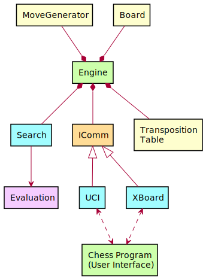
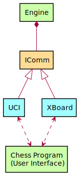
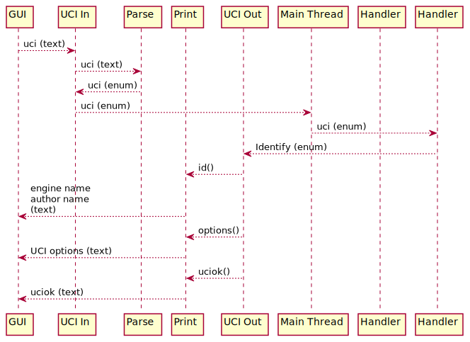

# Design

We finally arrived at the point where we can start designing the last piece
of the puzzle to complete the baseline chess engine. For some people,
creating the communication may be the first thing they do, or just do
somewhere in between, but I prefer to save it for last. First let's take a
look again at the architecture diagram from the _Design_ page in the
_Introduction_ chapter:

The important parts in the diagram are the _Engine_, _IComm_, _UCI_, and _XBoard_
parts (and to some extend, the _Chess Program_, but obviously we're not going
to change that.) If we split off the unneeded bits in the diagram, we're
left only with the bits relevant for this chapter:

The green objects, in this case the Engine and the Chess Program, are
distinct and separate programs. IComm is a so-called interface, which is
implemented by both UCI and XBoard. UCI and XBoard are _active_: this means
they have _threads_, separate from the _Engine_ thread, though all three
belong to the same program.

_Engine_ is the main thread, which is started as soon as the engine
executable starts. The engine has an object which can initialize any module
that implements the _IComm_ interface. Depending on its command-line
parameters, the engine either initializes _UCI_ or _XBoard_. In Rustic,
both are written in such a way as to instantiate two threads: one for
incoming commands from the GUI, one for outgoing replies.

The fun part is: the _Engine_ thread does not even know this. It doesn't
know that UCI and XBoard are active threads; it doesn't even know that a
different protocol is used. The only two things the engine is aware of are
the following:

1. I can receive messages from the part instantiated by IComm
2. If an incoming message is received, I should put it through the function
   that handles that type of message. (This is the so-called "handler.")
3. The handler instructs calls on the engine to perform certain functions,
   and sends an outgoing reply if necessary.

That's it. The engine has a _receiver_ for incoming commands and it obtains
a _sender_ for outgoing messages as soon as it instantiates IComm. In this
way, the engine doesn't need to know what the protocol even is: it only
knows how to handle its incoming commands, and what replies it should send.
The only part of the entire engine that knows anything about the protocol
used is the handler; and each handler only knows one protocol. Visualizing
this for UCI would look like this:

This is a fairly complicated diagram which requires some explanation, but
in the end it will turn out to be fairly straightforward. First, we have
the IComm interface in the lower left. This interface is used to build the
structure you see in the diagram. When the IComm object is initialized, it
sets up the in/out threads you see in the UCI part, and connects them to
the engine's main thread with so called _channels_.

A channel is a way of communication between two threads. Channels are used
to send messages between threads. One thread is the sender, while the other
thread is the receiver. If you want two threads to both send and receive
information back and forth, you will need two channels. (There probably are
ways to do this with only one channel, but I haven't looked into any for
Rustic.) If you want some more information about channels right now, you
can find it [in the Rust Programming Language
book](https://doc.rust-lang.org/book/ch16-02-message-passing.html).

Let's see what happens if the chess program sends the "uci" command.

In the diagram above, the GUI prints the "uci" command as text to its own
stdout. This is connected to the engine's stdin, where the UCI
communication module sits waiting for input. It catches the "uci" text and
puts it through a parsing function, which turns the command into an enum
variant, which also happens to be called "uci". (It could have been called
anything else.) Now the "uci" enum is sent to the main thread.

However... the main thread doesn't know anything about incoming commands;
uci, xboard, or otherwise. It receives an enum variant called "uci", so it
just passes it along to the handler. The handler _knows_ about the "uci"
enum and it determines that "someone" wants the engine to identify itself.
The handler doesn't know how that "someone" is: a GUI, or a user typing on
the command-line; it doesn't care. It just returns the enum variant
"identify" to the place where the incoming command came from.

In the UCI Out thread, the "identify" enum is of course known. It means
that it should execute the functions "id()", "options()", and "uciok(),
which makes the engine print the engine and author name, the UCI options,
and the text "uciok" to standard out. The GUI, whose stdin is connected to
that stdout, receives the reply and we're done.

All other commands and replies will travel the same path regardless of
which protocol they belong to. If the engine had been instantiated using
the XBoard protocol, it wouldn't understand UCI commands (because it's the
XBoard module running), but if you put in an XBoard command, it will handle
it in exactly the same way.

Note that there could have been an extra entry at the right of the above
sequence diagram: Actions. If a command comes in, it could be that the
engine needs to perform some action, such as setting up the board. The
handler will initiate this action and wait for the result. If required it
will then send a reply based on that result.

In the case of the "uci" command the engine doesn't need to perform any
actions, so this part has been left out. If we had described the "position"
command, the engine would have set up the incoming position using an
action, but it would not have sent back a reply because "position" doesn't
require a reply.

If you have been watching carefully, you may have noticed that the engine
_only_ receives input from the outside through an instance of IComm (in
this case, UCI or XBoard), and it _only_ sends replies through IComm. It
_never_ receives or prints things from anywhere else. This is essential of
keeping the engine itself clean of any protocol handling. If you use a
threaded infrastructure such as this one, there is no need to read commands
and print replies throughout the engine. This will keep the main engine and
the protocol handling separated, which will make it easy to add new
protocols in the future, should this be required.

The next topic will be on how to implement this threaded setup in Rust.
