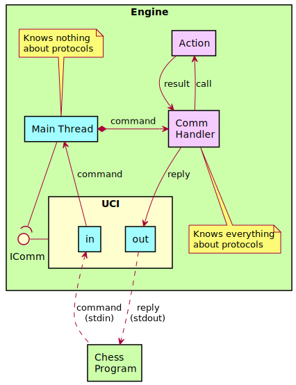

# Design

We finally arrived at the point where we can start designing the last piece
of the puzzle to complete the baseline chess engine. For some people,
creating the communication may actually be the first thing they do, or just
do somewhere in between, but I prefer to save it for last. First let's take
a look again at the architecture diagram from the _Design_ page in the _Introduction_
chapter:

The important parts in the diagram are the _Engine_, _IComm_, _UCI_, and _XBoard_
parts (and to some extend, the _Chess Program_, but obviously we're not going
to change that.) If we split off the unneeded bits in the diagram, we're
left only with the bits relevant for this chapter:

The green objects, in this case the Engine and the Chess Program, are
distinct and separate programs. IComm is a so-called interface, which is
implemented by both UCI and XBoard. UCI and XBoard are _active_: this means
they have _threads_, separate from the _Engine_ thread, though all three
belong to the same program.

_Engine_ is the main thread, which is started as soon as the engine
executable starts. The engine has an object which can initialize any module
that implements the _IComm_ interface. Depending on its command-line
parameters, the engine either initializes _UCI_ or _XBoard_. In Rustic,
both are written in such a way as to instantiate two threads: one for
incoming commands from the GUI, one for outgoing replies.

The fun part is: the _Engine_ thread does not even know this. It doesn't
know that UCI and XBoard are active threads; it doesn't even know that a
different protocol is used. The only two things the engine is aware of are
the following:

1. I can receive messages from the part instantiated by IComm
2. If an incoming message is received, I should put it through the function
   that handles that type of message. (This is the so-called "handler.")
3. The handler instructs calls on the engine to perform certain functions,
   and sends an outgoing reply if necessary.

That's it. The engine has a _receiver_ for incoming commands and it obtains
a _sender_ for outgoing messages as soon as it instantiates IComm. In this
way, the engine doesn't need to know what the protocol actually is: it only
knows how to handle its incoming commands, and what replies it should send.
The only part of the entire engine that knows anything about the protocol
used is the handler; and each handler only knows one protocol. Visualizing
this for UCI would look like this:

