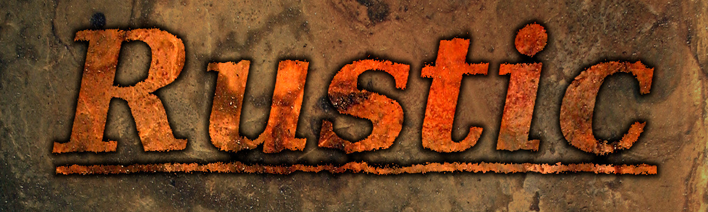

[Github code repository](https://github.com/mvanthoor/rustic)

# Creating the Rustic chess engine

or, the art of Chess Programming in Rust

__**Marcel Vanthoor**__ 

_Latest update:  September 8, 2024 - 18:45 (Dutch Time)_ 
_Make sure to press CTRL+F5 so you see the latest version of this book_. 

Most recently updated chapters: 
1. [Add the Piece List chapter](../board_representation/piece_list.md)
1. [Updated the Bitboards chapter](../board_representation/bitboards.md)
1. [Updated the Downloads chapter](../front_matter/downloads.md)
1. [Added the Game History chapter](../board_representation/game_history.md)
1. [Added the Game State chapter](../board_representation/game_state.md)
1. [Move some stuff to Board Functionality](../board_functionality/introduction.md)
1. [Updated the Zobrist Hashing chapter](../board_representation/zobrist_hashing.md)
1. [Added the Zobrist Hashing chapter](../board_representation/zobrist_hashing.md)
1. Add "This page has not been written yet" to empty pages 
1. Remove the Ramblings section 
1. [Evaluation - Tapering](../evaluation/tapering.md)
1. [About this book - Code consistency](../front_matter/about_book.md)
1. [Evaluation - Evaluation function](../evaluation/impl_eval.md)

© Marcel Vanthoor, 2019-2024