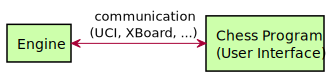

# Concept

What this book is about, is writing the chess *engine*, not the chess
*program*. There is a distinct difference. Most people know chess programs
in one way or another; many operating systems even include one in their
default installation. So what is the difference?

The part of the software that people normally call the "chess program" is
only the user interface, which the player uses to interact with the engine.
In the past, the user interface and the engine were often the same piece of
software, but nowadays this is mostly not the case. The user interface
cannot play chess, while the engine has only very limited means to interact
with a user, from a user's point of view.

So, they go together, like this:

The chess engine is on the left, the user interface is on the right. They
communicate with one another. This is done through strict rules, which are
called a "protocol." In the chess programming world, there are two main
protocols:

- XBoard: designed by Tim Mann and others in the early 1990's.
- UCI: designed by Stephan Meyer-Kahlen in 2001.

Both protocols are designed to do the same thing: create a standardized way
for a user interface and a chess engine to communicate with one another.
While there are advantages and disadvantages to either protocol, both can
accomplish this task equally well. In the "Communication" chapter, we'll
look deeper into both protocols.

Why do it like this? Well, because both protocols are standardized, user
interfaces and engines that understand the same protocol, should be
compatible. This means that chess programs and engines are interchangeable;
one program can run many engines, and one engine can run under many
different programs. This way, the user will be able to select the chess
program he likes best, and then also use his favorite engine.