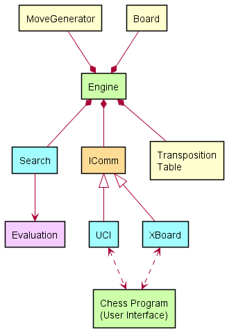

# Design

As described on the Concept page, we basically have two pieces of software:
the chess engine, and the chess program. (Henceforth, the "chess program"
will simply be called GUI, which stands for Graphical User Interface.)
These two programs communicate with one another using either the UCI or the
XBoard protocol.

If a GUI implements one or both of these protocols, we can assume that it
does so correctly. This means we can treat all the GUI's the same: we
"just" have to write the engine. As we're no longer having to pay any
attention to the GUI from this point onward (apart from the commands we're
going to send and receive), we can focus on the engine. Let's unpack the
Engine component from the concept diagram we saw on the previous page:

Wow. That got complicated fast. Don't panic. Just lets list all the shown
components and shortly describe what they do. Let's start with the meaning
of the colors:

- Green: These are distinct, running programs.
- Light-blue: These are active objects that contain threads. 
- Yellow: These are passive objects. They hold mutate, or provide data.
- Orange: These are interfaces. If a component adheres to an interface, it
  becomes interchangeable with other components adhering to the same
  interface.
- Pink: These are important functions within the engine.

The diagram shows all the important components an engine needs to play
proper chess.

- **Engine**: This is the main Engine program / object, that connects
  everything. It sits in the middle, like a spider in a web. No object has
  information about any other object, except if the Engine gives it to
  them. The engine knows all, and controls all.
- **MoveGenerator**: Generates pseudo-legal moves when requested.
- Board: Holds the current board position and game state.
- **Board**: Holds the current board and game state.
- **Search**: Searches for the best move in the position.
- **Evaluation**: Is called by Search, for evaluating positions during search.
- **UCI**: Implements the UCI-protocol (optional if implementing XBoard).
- **XBoard**: Implements the XBoard-protocol (optional if implementing UCI).

Two components shown are optional:

- **Transposition Table (TT)**: The transposition table stores moves and
  related information the engine has found during the search. Not strictly
  necessary, but it is a huge speed and strength booster.
- **IComm** (optional): This is a communication interface. The active
  objects UCI and XBoard implement this interface, thus they become
  interchangeable. This can be omitted if implementing only one protocol.

There are also some objects in the engine that are not yet visible in the
diagram above. They have been omitted because they are either part of one
of the other objects, or they are not needed for making the engine playing
chess. These objects will be discussed when we get to implementing the
features that need them.