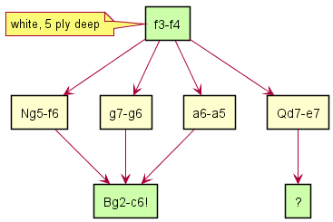

# Killer move heuristic

(Implemented since Rustic Alpha 3.)

Killer moves are another big time saver when searching. I have found in
testing many positions that sometimes, the killer move heuristic can save
almost as much time as ordering on the transposition table move. (We will
discuss ordering on the transposition table move later.) I've implemented
killer moves in Rustic Alpha 3, after the transposition table, but in
thinking about this afterward, they would better have been in Alpha 1
already. They bring quite a punch, especially taking into account how
simple they are to implement.

First let's take a look at what a killer move actually is.

A "killer move" is a quiet move that does not capture anything, but brings
a large advantage for the side making that move. The move is so named
because it is so strong that the opponent _must_ react to it, and thus it
"kills" lots of moves the opponent may have. Let's consider a simple
position in which nothing much is happening, but white is a bit better.
White is to move, but obviously, black is also thinking.

Assume black is thinking to improve the position of his knight: "My knight
is on the rim. I remember from my lessons: a knight on the rim is dim. When
it is my move again, I'm going to play it to _f6_, and then to _d5_. It
will be in the middle of the board, where it is much more active."

However, it is white to move, and he makes the unassuming move _f3-f4_. If
black fails to consider the change in position after the deceptively simple
pawn move and blindly goes ahead with his plan of _Nh5-f6_, white will
respond with:

__Bg2-c6!__

This Bishop move, which came available after _f3-f4_, attacks both the rook
and the queen. This is the "killer move", because it "kills" all the black
moves that do not take this threat into account. After _f3-f4_, this move
is available after several moves black may play, such as _Nh5-f6_, or
_g7-g6_, or _a6-a5_.

This is obviously a very simple position: most moves black could play are
obviously not that great. The point is still the same though: the move
_Bg2-c6!_ is a good move after a variety of black moves. This can be
defined as follows:

> A "killer move" is a quiet, non-captureing move which can cause a
> beta-cutoff in different branches of the tree at the same ply.

This may not be very intuitive. A diagram will probably help to clarify.
See the following diagram below:

Let's assume the search finds the move _f3-f4_ for white at ply 5 deep, and
it plays it on the board. The search will then iterate through moves for
black at ply 6, and _Nh5-f6_ will be among them. Next it's white's turn
again, at ply 7, and the search finds the move _Bg2-c6!_ with big material
gain.

Because of this big material gain, _Nh5-f6_ can't be played (it is
"killed"), because it doesn't take this threat into account.

The search now assumes: "Black just played _Ng5-f6_ at ply 6. White's move
_Bg2-c6_ at ply 7 is a great move. Maybe this is also a great move after
some other moves black may play at ply 6? Let's keep this in mind, and try
this move first, each time it's my move at ply 7!"

This assumption is correct: the move is a good response against at least
two other black moves (but not against _Qd7-e8_. After that move, black can
actually escape the double attack. Try to find out how later!).

This is exactly the killer move heuristic does: it saves the _Bg2-c6_ move
in a "killer move slot", so the search can try it first before other moves,
in similar positions at the same ply (in this case, at ply 7 for white).
Most engines have two slots: explanation will be below in the
implementation. When ordering the move list, the killer moves get a very
high score so they are just below the MVV-LVA captures. If the captures
turn out to be no good, the killer moves are the first to be tried, which
greatly speeds up the search.

Now that we know what a killer move is, let's take a look at the
implementation.
