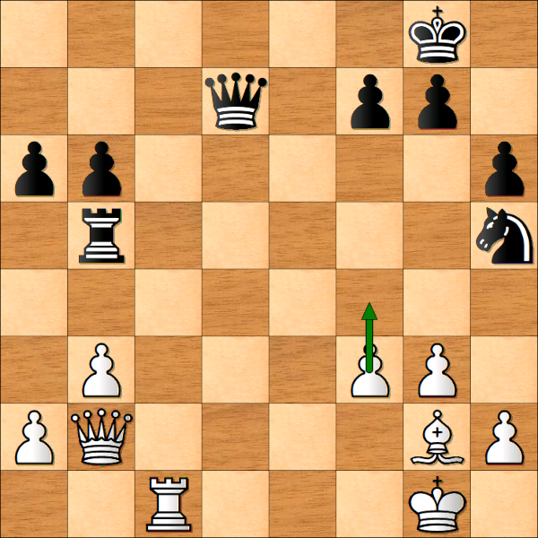
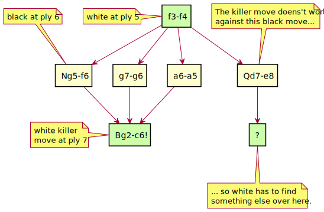

<!-- @import "[TOC]" {cmd="toc" depthFrom=1 depthTo=6 orderedList=false} -->

<!-- code_chunk_output -->

- [Killer move heuristic](#killer-move-heuristic)
  - [Explanation](#explanation)
  - [Implementation](#implementation)
  - [Puzzle solution](#puzzle-solution)

<!-- /code_chunk_output -->

# Killer move heuristic

(Implemented since Rustic Alpha 3.)

Killer moves are another big time saver when searching. In some positions,
they can have an effect as big as ordering on the transposition table move.
Because killer moves are much easier to implement than a transposition
table, I would advise to implement them _before_ implementing the TT,
instead of _after_, as I did in Rustic. (I just wanted the TT really badly
because of its huge Elo-boost, and I felt particularly greedy at the time
😎)

## Explanation

First let's take a look at what a killer move even is.

A "killer move" is a quiet move that does not capture anything, but brings
a large advantage for the side making that move. The move is so named
because it is so strong that the opponent _must_ react to it, and thus it
"kills" lots of moves the opponent may have. Let's consider a simple
position in which nothing much is happening, but white is a bit better.
White is to move, but obviously, black is also thinking.



Assume black is thinking to improve the position of his knight: "My knight
is on the rim. I remember from my lessons: a knight on the rim is dim. When
it is my move again, I'm going to play it to _f6_, and then to _d5_. It
will be in the middle of the board, where it is much more active."

However, it is white to move, and he makes the unassuming move _f3-f4_. If
black fails to consider the change in position after the deceptively simple
pawn move and blindly goes ahead with his plan of _Nh5-f6_, white will
respond with:

__Bg2-c6!__

This Bishop move, which came available after _f3-f4_, attacks both the rook
and the queen. This is the "killer move", because it "kills" all the black
moves that do not take this threat into account. After _f3-f4_, this move
is available after several moves black may play, such as _Nh5-f6_, or
_g7-g6_, or _a6-a5_.

This is obviously a very simple position: most moves black could play are
obviously not that great. The point is still the same though: the move
_Bg2-c6!_ is a good move after a variety of black moves. This can be
defined as follows:

> A "killer move" is a quiet, non-capturing move which can cause a
> beta-cutoff in different branches of the tree at the same ply.

This may not be very intuitive. A diagram will probably help to clarify.
See the following diagram below:



Let's assume the search finds the move _f3-f4_ for white at ply 5 deep, and
it plays it on the board. The search will then iterate through moves for
black at ply 6, and _Nh5-f6_ will be among them. Next it's white's turn
again, at ply 7, and the search finds the move _Bg2-c6!_ with big material
gain.

Because of this big material gain, _Nh5-f6_ can't be played (it is
"killed"), because it doesn't take this threat into account.

The search now assumes: "Black just played _Ng5-f6_ at ply 6. White's move
_Bg2-c6_ at ply 7 is a great move. Maybe this is also good after some other
moves black may play at ply 6? Let's keep this in mind. We (white) try this
move first, each time it's my move at ply 7!"

This assumption is correct: the move is a good response against at least
two other black moves, so it "kills" them too. In those two branches, the
killer move will turn out so strong, that searching deeper is useless,
because if black should allow this move without taking care of the threat,
black's going to lose big time. This is called a beta cutoff.

(This is the reason why the _Bg2-c6_ doesn't work against Qd7-e8. After
this move, black can escape from the double attack. He has thus
taken care of the threat, and the killer move doesn't work. Try to find out
later, how black escapes! If you can't see the solution, look at the bottom
of this page.)

This is exactly the killer move heuristic does: it saves the _Bg2-c6_ move
in a "killer move slot", so the search can try it first before other moves,
in similar positions at the same ply (in this case, at ply 7 for white).
Most engines have two slots. (See the sidenote at the bottom for the reason
why.) When ordering the move list, the killer moves get a very high score
so they are just below the MVV-LVA captures. If the captures turn out to be
no good, the killer moves are the first to be tried, which greatly speeds
up the search.

## Implementation

Now that we know what a killer move is, let's take a look at the
implementation.

Rustic has an instance of a struct called SearchInfo, which contains all
the information about the currently running search. The killer move slots
are part of this struct:

```csharp
type KillerMoves = [[ShortMove; MAX_DEPTH as usize]; MAX_KILLER_MOVES];

pub struct SearchInfo {
    some stuff here...

    pub killer_moves: KillerMoves,

    and so on...
}
```

The KillerMoves type is an array, indexed by the number of killer moves
(MAX_KILLER_MOVES is 2), and the maximum depth the search can reach in ply
(MAX_PLY, which is set at 125 for Alpha 3). This gives us _two_ killer
moves at each depth, which can be stored and retrieved by:

```csharp
let ply = 7;
let k1 = killer_moves[0][ply];
let k2 = killer_moves[1][ply];
```

The above code retrieves the first and second killer moves for ply 7. See
the sidenote at the bottom of this page why we keep two killer moves,
instead of one or three or even more.

The killer move is saved like this:

```csharp
pub fn store_killer_move(current_move: Move, refs: &mut SearchRefs) {
    let ply = refs.search_info.ply as usize;
    let first_killer = refs.search_info.killer_moves[0][ply];

    // First killer must not be the same as the move being stored.
    if first_killer.get_move() != current_move.get_move() {
        // Shift all the moves one index upward...
        for i in (1..MAX_KILLER_MOVES).rev() {
            let n = i as usize;
            let previous = refs.search_info.killer_moves[n - 1][ply];
            refs.search_info.killer_moves[n][ply] = previous;
        }

        // and add the new killer move in the first spot.
        refs.search_info.killer_moves[0][ply] = current_move.to_short_move();
    }
}
```

The function receives the current_move from the alpha-beta search, and the
"refs" pointer to the struct that stores all the references to the
information the search needs. A reference to the instance of SearchInfo is
also in there.

We first get the ply count, and cast it to _usize_ so we can use it to
index arrays. Then we get the first killer, just as was shown before in the
short code snippet. The if-statement is the part where we make sure the two
killers are unique: if the first killer move and the one we are inserting
are different, then both moves will always be different.

We loop through the list of killer moves (granted: it's a short loop), and
we shift all of them one index upward: so the move on spot 0 is copied to
spot 1, and the move on spot 1 is gone.  (If we did have three killer
moves, this one would go into spot 2.) Then the new killer move is inserted
into spot 0 of the killer_moves array.

Ordering moves is a little bit more complicated than ordering on MVV-LVA.
The score_move function needs to be extended, to take the killer moves into
account. This is the score_moves function, with killer move ordering added:

```csharp
const MVV_LVA_OFFSET: u32 = u32::MAX - 256;
const KILLER_VALUE: u32 = 10;

pub fn score_moves(ml: &mut MoveList, tt_move: ShortMove, refs: &SearchRefs) {
    for i in 0..ml.len() {
        let m = ml.get_mut_move(i);
        let mut value: u32 = 0;

        if m.captured() != Pieces::NONE {
            value = MVV_LVA_OFFSET + MVV_LVA[m.captured()][m.piece()] as u32;
        } else {
            let ply = refs.search_info.ply as usize;
            let mut i = 0;
            while i < MAX_KILLER_MOVES && value == 0 {
                let killer = refs.search_info.killer_moves[i][ply];
                if m.get_move() == killer.get_move() {
                    value = MVV_LVA_OFFSET - ((i as u32 + 1) * KILLER_VALUE);
                }
                i += 1;
            }
        }

        m.set_sort_score(value);
    }
}
```

There are some new parts in the function. At first, we have these two new
constants:

```csharp
const MVV_LVA_OFFSET: u32 = u32::MAX - 256;
const KILLER_VALUE: u32 = 10;
```

Ordering the moves is done in this way:

- The transposition table move comes first (to be discussed)
- Then the captures using MVV-LVA
- After that, the two killer moves
- And below the killer moves are the moves sorted by the history heuristic
  (to be discussed)

To make this work, we use the MVV_LVA_OFFSET. This value is the maximum a
32-bit integer can hold, minus 256. So, we have 256 values available,
'above' MVV_LVA_OFFSET. Now you can see why in the MVV-LVA chapter, I said
that I like to keep values as low as possible. As the highest value in the
MVV-LVA table is 55, it will fit comfortably in the 256 values which are
available above MVV_LVA_OFFSET.

First, we iterate through the move list, so we can order all the moves.
This is the first for-loop:

```csharp
for i in 0..ml.len() { ... }
```

Inside the loop we now need to distinguish between captures and
non-captures. This is what the if-statement does.

```csharp
if m.captured() != Pieces::NONE { ... }
```

If the move is a capture, it will be ordered using the MVV-LVA table just
like before (see the chapter about MVV-LVA), but now, it shifts everything
upward by the MVV_LVA_OFFSET.

So, we get space (values) available 'below' MVV_LVA_OFFSET.

If the move is not a capture, we try to find it in the list of killer
moves. We just loop through the list as long as we are not at the end, and
as long as the sort value is still 0.

```csharp
while i < MAX_KILLER_MOVES && value == 0 { ... }
```

(As long as the sort value is 0, the move is not yet ordered.) As soon as
we match the move in the move list against a killer move, its sort value is
calculated, using both MVV_LVA_OFFSET, and KILLER_VALUE (which is set to
10).

```csharp
value = MVV_LVA_OFFSET - ((i as u32 + 1) * KILLER_VALUE);
```

If we match the first killer at spot 0, the value will be:

```csharp
value = MVV_LVA_OFFSET - ((0 + 1) * 10)
value = MVV_LVA_OFFSET - (1 * 10)
value = MVV_LVA_OFFSET - 10
```

Pay attention to the fact that we are sorting killers _below_
MVV_LVA_OFFSET this time, so the killers will be a lower value than any
capture. The first killer will be 10 points below MVV_LVA_OFFSET, the
second killer will be 20 points below. (I you should manage to make 3 or 4
killers work, they would be 30 and 40 points below respectively.)

Now the killers are ordered below the captures. Killer move ordering is now
done, and alpha-beta will use pick_move() to pick a killer before an
unordered move.

> **Sidenote: number of killer moves** We keep two killer moves because we
> don't keep one or three moves. Well, maybe that's not an answer :) The
> reason why we don't keep three, four or 20 killer moves per ply is
> because they work best if each killer move is unique: so no slots have
> the same move. Making sure that two killer moves are unique is very easy
> and fast, as you saw in the implementation above.
>
> Experience and testing have shown that two unique killer moves per ply
> are better than only one killer move per ply, and that trying to keep
> three or more killer moves unique from one another costs more time than
> the killer move feature saves. Therefore, in most engines, keeping more
> than two killer moves unique is detrimental to the engine's speed. With
> the implementation above, you could try to keep three killer moves for
> each ply, hoping that some of the time there will be no duplicates. In
> some engines this can work, but you will have to try and test it.

<hr />

## Puzzle solution

Here is the position from the start again:


White plays _f3-f4_, setting up the double attack threat _Bg2-c6_, which
can be used as a killer move after various black moves. Question: Why does
_Bg2-c6_ not work anymore as a killer move, when black plays _Qd7-e8_?

> **Solution** After _Qd7-e8_, _Bg2-c6_ doesn't work as a killer move
> because black can escape the double attack by playing Qe8-e3+. White has
> to get his king out of check, for example _Kg1-h1_, and then black can
> move the rook on _b5_ out of danger.
> 
> Warning: Qe8-e3+ is quite a sneaky move. If white tries to to trade the
> queens by blocking the check with _Qb2-f2_, the rook on _c1_ becomes
> undefended and the black queen can capture it with another check!