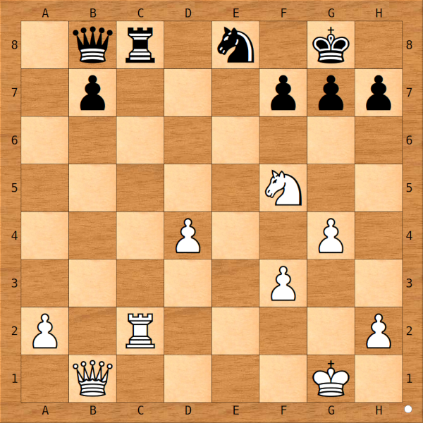

# The reason

Why would you want to order the moves the engine is going to search? The
answer to that may not be immediately obvious. However, if you take a
moment to take into account how a human thinks about a position, everything
will become clear. Consider the following position, with white to move:

There are a lot of moves that can be played. The rook and the queen have 22
moves together, and we're not even counting the king, the kinght, and the
pawns. You may ask yourself: Which moves should I consider _first_? That is
a perfectly valid question, because moves are not of equal value.

- a2-a3? Nah. That move does nothing.
- Nf5xg7, winning a pawn? No. The black king will just recapture.
- Maybe Nf5-e7+, attacking the king and the rook at the same time?

The last move seems to be great: it attacks the black king AND the rook,
and after the king moves, the rook can be captured. Great. But wait...
there's bigger fish to fry.

__Rc2xc8!__

At first, this move only seems to trade rooks after Qb8xc8, but you have to
realize that it's now the black _queen_ on c8, and the move Nf5-e7+ is
still on the board: the knight now attacks the black king and the black
_queen_, for an even greater gain.

So, what if black doesn't take the white rook, and moves the queen off the
back rank with Qb8-a7? White could still play Nf7-e7+, but now that would
be a mistake. The better move is:

__Rc8xe8#!__

Black is in checkmate. The queen is unable to move off the back rank and
keep the knight covered at the same time. Qb8xh2+ is possible, but then
white will just recapture the black queen, so that's not good. Worse, the
Rc8xe8 checkmate threat is still on the board.

Thus after Rc2xc8, the response Qb8xc8 is the only good (or more accurate,
the least bad) move for black, even though white will follow it up with
Nf5-e7+, which wins the black queen and the game.

The takeaway from this example is that in chess, most moves on the board
are actually disregarded by humans. As you have seen in the position above,
the order in which moves are evaluated is the following.

- Captures are evaluated before quiet moves.
- Good captures are evaluated before bad captures.
- Checks come before completely quiet moves.

Using techniques like these, humans narrow down the list of moves to
examine. A chess engine has to do the same thing, or it will be examining a
lot of useless moves. This slows it down in finding good moves and it will
be weaker because of that. If the engine has a way of examining good moves
first, it can skip searching huge chunks of the search tree, saving a lot
of time in finding the promising variations. It can use this saved time to
search deeper, and it will become stronger as a result.

In this subchapter, we'll discuss various techniques on how to order moves
during the search. To make the gains of these techniques clear, some
examples with the results obtained will be provided.